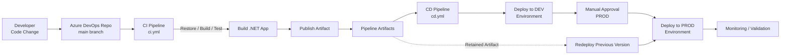

```mermaid
flowchart LR
    Dev[Developer<br/>Code Change] --> Repo[Azure DevOps Repo<br/>main branch]

    Repo --> CI[CI Pipeline<br/>ci.yml]
    
    CI -->|Restore / Build / Test| Build[Build .NET App]
    Build --> Publish[Publish Artifact]
    Publish --> Artifacts[Pipeline Artifacts]

    Artifacts --> CD[CD Pipeline<br/>cd.yml]

    CD --> DevEnv[Deploy to DEV<br/>Environment]
    DevEnv --> Approval[Manual Approval<br/>PROD]
    Approval --> ProdEnv[Deploy to PROD<br/>Environment]

    ProdEnv --> Monitor[Monitoring / Validation]

    Artifacts -.->|Retained Artifact| Redeploy[Redeploy Previous Version]
    Redeploy --> ProdEnv
```
